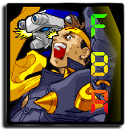

# Arcade (FB Alpha 2012)

### Description

Final Burn Alpha is an emulator of arcade games, including Capcom CPS-1 and CPS-2, SNK Neo-Geo, Toaplan, Cave and Sega System 16.

The 2012 version runs better on older hardware.

### License

Non-commercial

### Icon

### Fanart

Help make me fanart!

### Screenshots

Help make me screenshots!

### Disclaimer

*The authors of FB Alpha do not guarantee its fitness for any purpose, implied or otherwise, and do not accept responsibility for any damages whatsoever that might occur when using FB Alpha. All games emulated by FB Alpha, including any images and sounds therein, are copyrighted by their respective copyright holders. Icon credit: TRIPLEKILLZ (triplekillz.deviantart.com)*
